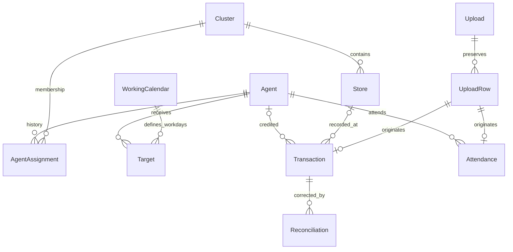

# V1 database design

## Scope and conventions

Sales + targets + attendance + reconciliation + performance reporting.
No store ownership by agents, store coverage, location tracking, or attendance-based
sales rejection. Stores belong to clusters; sales cluster attribution follows the
agent's dated assignment, not the store's current cluster.

MongoDB ObjectIds link documents internally. `agentId`, `employeeId`, `storeId`,
`clusterId`, and source transaction IDs support external mapping. Names never serve
as relational keys. Optional IDs must be omitted, not stored as empty strings.

Money uses safe integer kobo: ₦319,000 = 31,900,000 kobo. Parse decimal source
strings exactly before conversion; do not use floating point to round uploads.
V1 clean sales require positive values. Refunds, reversals, and zero-value sales
remain exceptions until an approved business rule exists.

Business dates are validated `YYYY-MM-DD` strings in Africa/Lagos. Clock timestamps
and audit timestamps are UTC instants. Reporting months use `YYYY-MM`.

## Collections and grain

| Model | One document represents | Identity / constraint |
| --- | --- | --- |
| User | Application account | Unique normalized email |
| Cluster | Cluster and zone | Unique clusterId and name |
| Agent | Executive identity and employment dates | Unique agentId; optional unique employeeId |
| AgentAssignment | Dated cluster, supervisor, and employment status | Unique agent + effectiveFrom |
| Store | Store master record | Unique storeId; no agent assignment |
| WorkingCalendar | Named monthly working-day calendar | Unique month + name |
| Target | Agent's target for one month | Unique agent + month |
| Upload | One upload attempt, metadata and approval | Unique uploadId; file hash is searchable, not unique |
| UploadRow | One original sheet row plus validation outcome | Unique upload + sheet + rowNumber |
| Transaction | Canonical sale after normalization | Unique sourceSystem + transactionId |
| Attendance | Canonical agent-day attendance | Unique agent + businessDate |
| Reconciliation | One approved correction | Unique idempotencyKey |
| PlanMapping | Approved source label mapping | Unique sourceSystem + rawPlan |
| AuditLog | One recorded administrative change | Indexed by entity and time |

Reconciliation also supports attendance and staging rows using entityType/entityId.
ObjectId references do not enforce foreign keys in MongoDB.

## Import and reconciliation contract

1. Store the original file at `storageKey`, record its SHA-256 hash and uploader,
   and preserve each raw row. Do not overwrite raw files or raw rows. `normalized`
   and validation issues are separate from the immutable raw payload.
2. Validate schema, referenced masters, effective assignments, dates, value, and
   source labels. A bad raw value must remain representable in UploadRow even if
   it cannot be represented in Transaction. Preview precedes approval and import.
3. Missing transaction IDs remain flagged. Do not invent a fingerprint until actual
   source columns establish a safe identity rule. Source namespaces must be stable
   across exports of the same transaction feed.
4. Repeated transaction IDs with identical normalized data are duplicates. Changed
   data creates an exception for review; never blindly upsert over canonical sales.
   Retain the new raw row and link it to the existing transaction. Repeated files
   are recorded as separate attempts and detected through their hash.
5. Only `VALID` transactions enter attributed performance totals. Valid records
   require an agent and historical cluster. `PENDING`, `UNATTRIBUTED`, `EXCLUDED`,
   and `TEST` remain outside those totals. Display unresolved counts and values
   separately. Overall treatment of approved unattributed sales needs business signoff.
6. Unknown plans stay `UNCLASSIFIED`, preserving rawPlan and a warning; do not infer
   SLD/SAP/ESSENTIAL. Financially valid sales can remain valid while unclassified.
7. Commit the canonical correction, Reconciliation entry, and relevant audit event
   together in a MongoDB transaction. Compare expectedVersion with the current
   document version to prevent lost updates. Enforce unique idempotencyKey on retries.
   Future imports cannot overwrite approved corrections. Restore requires a new
   approved event, never deletion of the old one.
8. Attendance exports may contain multiple clock events. Preserve all source rows;
   consolidate only under a defined source rule into one agent-day. Conflicting
   statuses require review. Missing attendance is unknown, not automatically absent.
9. Reconcile upload counts using mutually exclusive row outcomes. Warning counts
   are issue counts and must not be added to record counts. Complete imports only
   after all intended canonical writes commit; support retries from row outcomes.

## Historical and reporting rules

- Assignment periods are inclusive and must not overlap for an agent. Resolve the
  assignment effective on each sale date; persist that cluster on the sale. Agent
  reassignment does not move historical sales. Explicit retrospective changes are audited.
- Targets are month-specific. Changes increment revision and write before/after
  snapshots to AuditLog. Calendar edits also require auditing. Calendar month must
  match target month. Freeze approved reporting calendars once used, or explicitly
  audit and recalculate a correction. Never assume 26 working days.
- As-of reporting filters both sales and attendance to the selected month through
  the reporting date. Active days count distinct PRESENT dates. Productive days
  are their intersection with dates containing a valid sale. Zero-sale active days
  equal active days minus productive days.
- Attendance rate uses eligible elapsed working days after employment/status
  adjustments. Leave treatment and attendance on non-working days need agreement.
- Transactions/value per active day use all valid MTD transactions/value divided
  by active days, as specified in the PRD. Sales outside attended days remain valid
  and are separately flagged. Missing attendance data does not prove absence.
- Return null/N/A for zero denominators. Expected MTD = target × elapsed / total
  working days. Pace = MTD / expected MTD. Forecast = MTD / elapsed × total days.
  Required daily rate = max(target − MTD, 0) / remaining working days; at month end
  show N/A and the remaining balance. Sum money before calculating ratios.
- Do not store aggregate dashboard totals as primary truth. Combined scores and
  performance thresholds are deferred until data and business definitions stabilize.

## Enforcement boundaries and remaining inputs

Schemas enforce types, enumerations, local required fields, valid dates, integer
money, selected cross-field conditions, and index definitions. Offline tests do not
prove database index enforcement. Create indexes before accepting writes and handle
duplicate-key errors. Load and save full documents for cross-field validation;
generic update validators do not provide equivalent protection.

Services must enforce reference existence, non-overlapping assignment periods,
state transitions, upload approvals, authorization, transactional reconciliation,
calendar/target consistency, and historical status checks. Use append-only database
permissions for audit/reconciliation writers and protect raw storage: Mongoose
immutable fields alone are not a tamper-proof audit system. Never log password hashes
or include them in audit snapshots. No authentication or authorization is supplied yet.

Needed next: real agent/store/sales/attendance exports; source ID rules; approved
calendar; attendance status mapping; target revisions/proration; refund rules;
unattributed sales policy; approved management report. No fabricated data is seeded.

Implementation reference: [Mongoose validation](https://mongoosejs.com/docs/validation.html)
and [schema options/indexes](https://mongoosejs.com/docs/guide.html).
